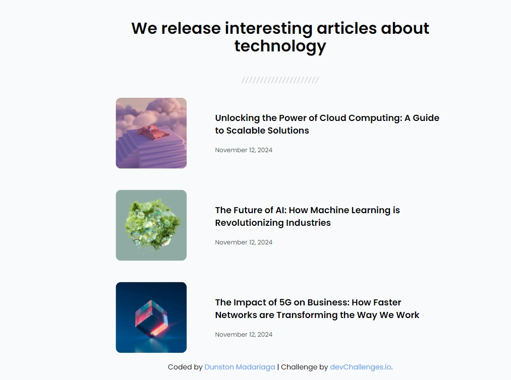

<!-- Please update value in the {}  -->

<h1 align="center">Simple Article Listing | devChallenges</h1>

   Solution for a challenge <a href="https://devchallenges.io/challenge/simple-article-listing" target="_blank">Simple Article Listing</a> from <a href="http://devchallenges.io" target="_blank">devChallenges.io</a>.

  <h3>
    <a href="https://devchallenge-simple-article-listing.netlify.app">
      Demo
    </a>
     | 
    <a href="{https://your-url-to-the-solution}">
      Solution
    </a>
     | 
    <a href="https://devchallenges.io/challenge/simple-article-listing">
      Challenge
    </a>
  </h3>

<!-- TABLE OF CONTENTS -->

## Table of Contents

- [Overview](#overview)
  - [What I learned](#what-i-learned)
  - [Useful resources](#useful-resources)
- [Built with](#built-with)
- [Features](#features)

<!-- OVERVIEW -->

## Overview

### What I learned

With this challenge I have been able to learn Tailwind although not in its entirety, because I know that I don't think I'm getting the most out of it due to the fact that I'm just starting to understand it.
As for the challenge there were no complications, it was an entertaining challenge.

### Useful resources

[Tailwind](https://tailwindcss.com/)
[Normalize](https://necolas.github.io/normalize.css/)

### Built with

- Semantic HTML5 markup
- [Tailwind](https://tailwindcss.com/)
- Flexbox

## Features

<!-- List the features of your application or follow the template. Don't share the figma file here :) -->

This application/site was created as a submission to a [DevChallenges](https://devchallenges.io/challenges-dashboard) challenge.

## Author

- Website [Website](https://devchallenge-simple-article-listing.netlify.app)
- GitHub [Pogo182028](https://github.com/Pogo182028)
